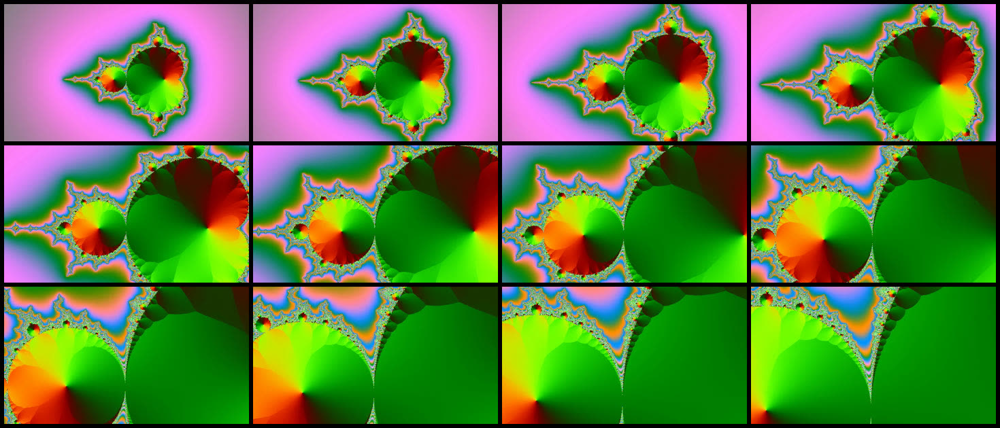
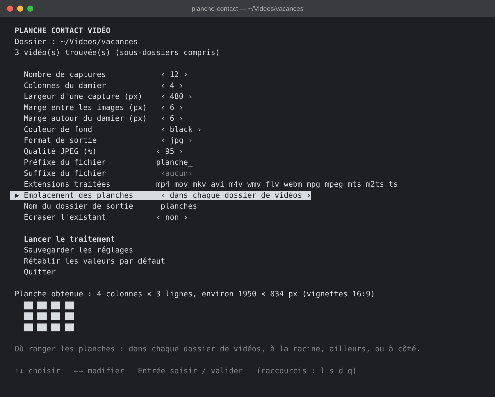
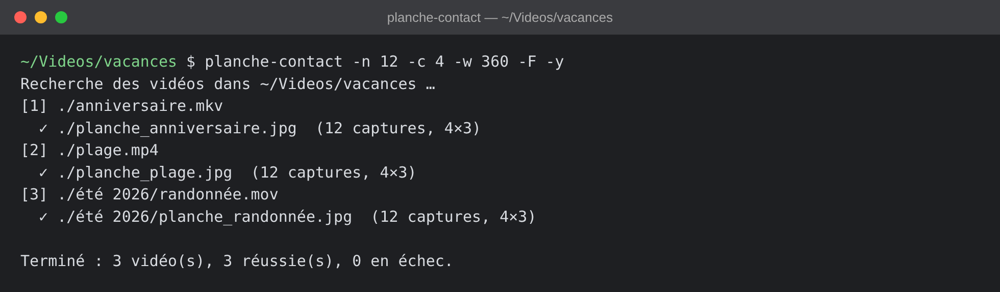

> [!WARNING]
> Ce projet a été vibecodé avec l’aide de l’intelligence artificielle.

# planche-contact

Script shell pour macOS qui parcourt le dossier courant et ses sous-dossiers, puis génère pour chaque vidéo une **planche contact** : plusieurs captures d'écran réparties uniformément sur la durée de la vidéo, assemblées en damier avec une légère marge, et enregistrées sous le nom de la vidéo, avec un préfixe et/ou un suffixe au choix.



Les réglages se modifient dans un menu textuel navigable au clavier, ou directement par options en ligne de commande.

## Installation

```bash
brew install ffmpeg          # fournit ffmpeg et ffprobe
git clone https://github.com/charlescoiffier/planche-contact.git ~/Developer/planche-contact
```

Le script est compatible avec le bash 3.2 fourni avec macOS. Aucune autre dépendance.

### En faire une commande

Créez un lien vers le script dans un dossier du `PATH` (le nom du lien est celui de la commande) :

```bash
mkdir -p ~/bin
ln -s ~/Developer/planche-contact/planche-contact.sh ~/bin/planche-contact
echo 'export PATH="$HOME/bin:$PATH"' >> ~/.zshrc && source ~/.zshrc
```

Pour une commande plus courte, changez le nom du lien : `ln -s … ~/bin/planche`.

### Mise à jour

Le lien pointe vers le dépôt cloné : il suffit de le mettre à jour.

```bash
cd ~/Developer/planche-contact && git pull
```

## Utilisation

Placez-vous dans le dossier à traiter, puis lancez la commande :

```bash
cd ~/Videos/vacances
planche-contact
```

### Le menu



Le menu affiche le nombre de vidéos trouvées, les réglages, et un aperçu de la planche (nombre de lignes et de colonnes, taille approximative en pixels).

| Touche | Action |
|---|---|
| `↑` `↓` | Choisir une ligne : un réglage, ou l'une des quatre actions en bas du menu |
| `←` `→` ou `Espace` | Modifier la valeur du réglage : ±1 pour les nombres (±20 px pour la largeur), liste de choix pour la couleur, le format, l'emplacement et « écraser » |
| `Entrée` | Sur un réglage : saisir une valeur au clavier. Sur une action : la valider |

Les quatre actions du bas du menu se choisissent aussi avec les flèches :

| Action | Raccourci | Effet |
|---|---|---|
| Lancer le traitement | `l` | Traite toutes les vidéos trouvées |
| Sauvegarder les réglages | `s` | Enregistre dans `~/.planche-contact.conf` (rechargés au lancement suivant) |
| Rétablir les valeurs par défaut | `d` | Remet les réglages d'origine, sans les sauvegarder |
| Quitter | `q` | Quitte sans rien traiter |

Les valeurs invalides sont refusées avec un message. Pour le préfixe, le suffixe et le dossier de sortie, saisir `-` revient à « aucun » (le nom du dossier de sortie revient alors à `planches`).

### Le traitement



Chaque vidéo est affichée avec le fichier produit et la disposition obtenue. Par défaut, les planches sont rangées dans un sous-dossier `planches` créé dans chaque dossier contenant des vidéos (l'emplacement se règle, voir plus bas). Une planche déjà présente est ignorée, sauf si « Écraser l'existant » est sur `oui`.

### Sans menu : options en ligne de commande

Les options préremplissent le menu et prennent le pas sur les réglages sauvegardés. Avec `-y`, le traitement démarre directement, ce qui permet de l'utiliser dans un autre script. Sans terminal (script, cron, redirection), le menu n'est jamais affiché.

```bash
planche-contact -n 12 -c 4 -w 360 -F -y
planche-contact -p "" -s _planche -y      # plage.mp4 → planches/plage_planche.jpg
planche-contact -o miniatures -y          # sous-dossiers « miniatures » au lieu de « planches »
planche-contact -O racine -y              # un seul dossier « planches » à la racine
planche-contact -O ailleurs -o ~/Pictures/planches -y
planche-contact -O cote -y                # planches à côté de chaque vidéo
```

| Option | Réglage |
|---|---|
| `-n` | Nombre de captures |
| `-c` | Colonnes |
| `-w` | Largeur d'une capture (px) |
| `-m` / `-M` | Marge entre les images / autour du damier (px) |
| `-b` | Couleur de fond |
| `-f` | Format (`jpg` ou `png`) |
| `-q` | Qualité JPEG (1 à 100) |
| `-p` / `-s` | Préfixe / suffixe du fichier produit |
| `-O` | Emplacement du dossier de sortie : `chaque`, `racine`, `ailleurs` ou `cote` (voir ci-dessous) |
| `-o` | Nom du dossier de sortie (ou chemin complet avec `-O ailleurs`) |
| `-F` | Écraser les planches existantes |
| `-y` | Lancer sans menu |
| `-h` | Aide |

## Réglages

| Réglage | Défaut |
|---|---|
| Nombre de captures par vidéo | 12 |
| Colonnes du damier | 4 |
| Largeur d'une capture (px) | 480 |
| Marge entre les images (px) | 6 |
| Marge autour du damier (px) | 6 |
| Couleur de fond (nom ffmpeg ou `0xRRGGBB`) | black |
| Format de sortie : `jpg` ou `png` | jpg |
| Qualité JPEG (1 à 100, jpg uniquement) | 95 |
| Préfixe du fichier de sortie (avant le nom) | `planche_` |
| Suffixe du fichier de sortie (après le nom) | vide |
| Extensions vidéo traitées | mp4 mov mkv avi m4v wmv flv webm mpg mpeg mts m2ts ts |
| Emplacement des planches : dans chaque dossier de vidéos, à la racine, ailleurs, à côté des vidéos | dans chaque dossier |
| Nom du dossier de sortie (chemin avec « ailleurs ») | `planches` |
| Écraser les planches existantes | non |

## Fonctionnement

- Les vidéos sont recherchées avec `find`, dans le dossier courant et tous ses sous-dossiers, sans tenir compte de la casse des extensions.
- La durée est lue avec `ffprobe`. Les captures sont prises au milieu de N tranches égales de la vidéo : elles sont donc réparties uniformément, sans jamais tomber sur la toute première ou la toute dernière image.
- L'assemblage utilise le filtre `tile` de ffmpeg (marge entre les images et marge extérieure réglables).
- **Emplacement des planches.** Quatre choix (réglage « Emplacement des planches », option `-O`) :

  | Choix | Résultat pour `x.mp4` et `a/y.mov` |
  |---|---|
  | `chaque` (défaut) | `planches/planche_x.jpg` et `a/planches/planche_y.jpg` : un sous-dossier dans chaque dossier contenant des vidéos |
  | `racine` | `planches/planche_x.jpg` et `planches/a/planche_y.jpg` : un seul dossier dans le dossier analysé, avec l'arborescence recopiée |
  | `ailleurs` | même chose que `racine`, mais dans le dossier de votre choix, par exemple `-O ailleurs -o ~/Pictures/planches` |
  | `cote` | `planche_x.jpg` et `a/planche_y.jpg` : à côté des vidéos, sans sous-dossier |

  Le nom du dossier se règle dans le menu ou avec `-o` (un simple nom pour `chaque`, un chemin relatif pour `racine`, un chemin quelconque pour `ailleurs`). Les dossiers de sortie situés dans l'arborescence analysée ne sont pas parcourus lors de la recherche des vidéos, et les dossiers sans vidéo ne sont pas touchés.
- Le fichier produit s'appelle `<préfixe><nom de la vidéo><suffixe>.<format>`. Par exemple, `plage.mp4` donne `planche_plage.jpg` (dans le dossier de sortie) avec le préfixe par défaut, ou `plage_planche.jpg` avec `-p "" -s _planche`. Préfixe et suffixe peuvent aussi être utilisés ensemble.
- Les fichiers dont le nom commence par le préfixe sont ignorés lors de la recherche.
- Si le nombre de captures n'est pas un multiple du nombre de colonnes, les cases vides prennent la couleur de fond.
- Si certaines captures échouent, la planche est assemblée avec celles obtenues.
- Les calculs de durée sont indépendants de la langue du système (point décimal forcé), ce qui évite les erreurs avec une locale française.

## Captures d'écran

Les images de ce README sont générées à partir de la sortie réelle du script (rendu d'un terminal sombre), sur des vidéos de démonstration ; les chemins sont raccourcis en `~/Videos/vacances`.
